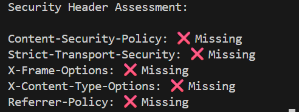
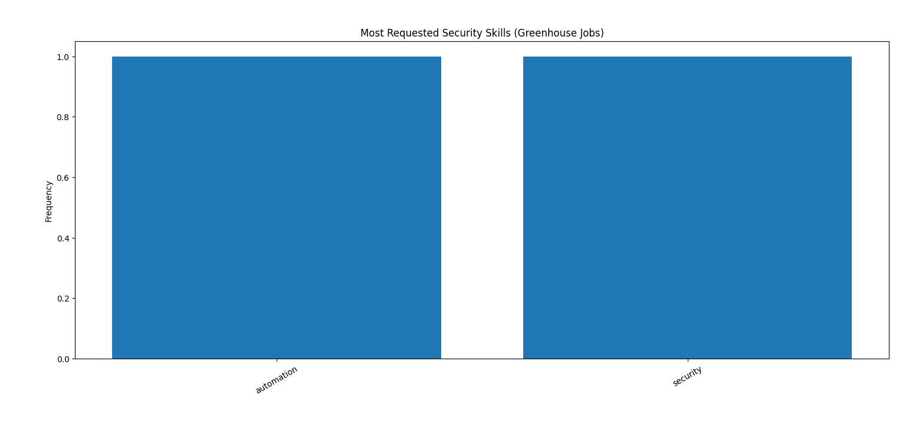

# 🛡️ Security Job Market Intelligence Scraper

## Overview

Modern career pages look simple on the surface, but under the hood they are complex, JavaScript-heavy web applications protected by multiple layers of security controls.

This project started as a simple question:

> **“Why can’t I just fetch job descriptions with a normal HTTP request?”**

To answer that, I built an ethical web scraping system that extracts security-related job data from **Greenhouse-hosted career pages**, while intentionally studying how modern websites render content and defend themselves against automation.

The goal of this project is **not large-scale scraping** — it is understanding **how the web actually works**.

---

## Why Greenhouse?

Greenhouse is widely used by startups and security-focused companies for hiring.  
It also represents a realistic scraping challenge because:

- Job data is **not available via a public API**
- Pages rely heavily on **client-side JavaScript rendering**
- Basic bots are quietly filtered using **HTTP and browser-level signals**

This makes Greenhouse a great real-world case study.

---

## What This Project Does

- Scrapes **publicly accessible job postings**
- Handles **JavaScript-rendered DOM content** using a real browser engine
- Analyzes **HTTP response headers** for security posture
- Extracts and visualizes **commonly requested security skills**
- Documents **anti-scraping mechanisms** without attempting to bypass them

---

## Project Architecture
Static Request (requests + BS4)
↓ (fails – no job data)
JavaScript Execution (Playwright)
↓
Rendered DOM Extraction
↓
Keyword & Skill Analysis

This intentional comparison between static and dynamic scraping is a core part of the project.

---

## Key Learnings

### 1. Static Scraping Breaks on Modern Web Apps

Fetching the HTML directly returns an incomplete document.  
Most meaningful content is injected **after JavaScript execution**, which explains why tools like `requests` and `curl` fail on modern career portals.

---

### 2. Browsers Matter

Using Playwright allowed the page to:

- Execute JavaScript  
- Make internal fetch/XHR calls  
- Build the final DOM exactly as a real user would see it  

Scraping modern websites increasingly means understanding **browsers, not just HTML**.

---

### 3. HTTP Is a Security Signal

While scraping, I observed how servers use:

- User-Agent filtering  
- Rate limiting (`429`)  
- Security headers (CSP, HSTS, etc.)

Even when no CAPTCHA is visible, servers continuously assess **client behavior**.

---

## 🔐 Security Header Assessment

As part of the analysis, response headers from Greenhouse-hosted pages were examined to understand baseline security posture.

This included checks for:

- Content Security Policy (CSP)  
- HSTS  
- Clickjacking protections  
- MIME-type enforcement  

This step reinforced how **defensive controls exist even on non-sensitive pages**.

---

## 📊 Skill Trend Analysis

Extracted job descriptions were analyzed to identify frequently requested skills across security-related roles.

This step transforms scraping output into **actionable insight**, highlighting tools and technologies that consistently appear in real job requirements.

---

## Anti-Scraping & Ethical Boundaries

This project deliberately avoids bypassing protective mechanisms.

- CAPTCHA challenges are **not bypassed**
- Request rates are kept **intentionally low**
- Only public, unauthenticated data is accessed
- `robots.txt` is respected

Understanding defenses is more valuable than defeating them.

---

## Inspiration

This work is inspired by automation-first startups like **Yutori**, which explore how autonomous agents interact with modern web interfaces.

From a security perspective, this raises important questions:

- How do websites distinguish humans from agents?  
- How should defenses evolve as agents become more capable?  

This project explores those questions from a **defensive and ethical lens**.

---

## Future Work

Possible extensions include:

- Automatically detecting DOM layout changes  
- Comparing multiple companies over time  
- Modeling scraper behavior as an autonomous browser agent  
- Deeper analysis of bot-detection signals  

---

## Disclaimer

This project is intended **strictly for educational and research purposes**.  
It does not collect personal data, bypass authentication, or attempt to defeat security mechanisms.

---

## Final Thoughts

This project helped me understand that web scraping isn’t just about extracting data —  
it’s about **how systems communicate, defend themselves, and evolve**.

That perspective is what makes the problem interesting.
